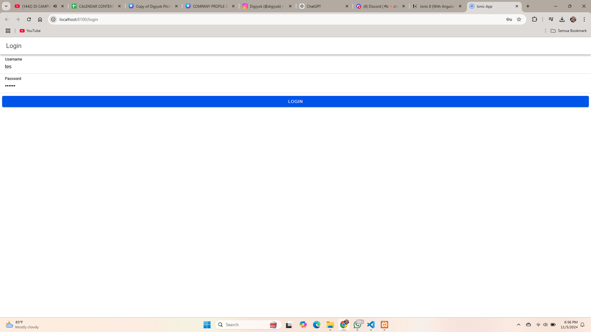
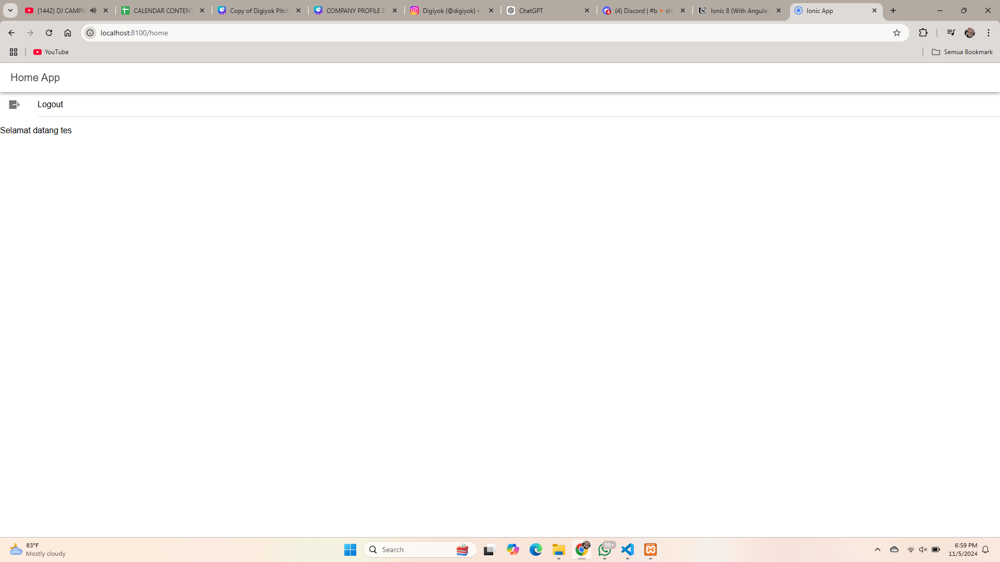

## Cara Kerja Login
1. Form Login : Pengguna mengisi formulir dengan informasi seperti Username dan Password
2. Validasi Data : Aplikasi memvalidasi input pengguna sebelum mengirim permintaan ke server
3. API Request : Informasi login dikirim ke API untuk diproses
4. Verifikasi Server : Server memeriksa keocokan data dengan database
5. Respon : Jika data valid, server mengirimkan token autentikasi ke pengguna
6. Token Storage : Token disimpan di penyimpanan lokal untuk sesi pengguna

## Screenshot

